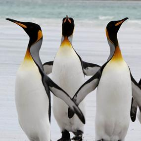

This is my first post on my new fake blog! How exciting!

I'm sure I'll write a lot more interesting things in the future.

Oh, and here's a random page about
[penguins](https://www.birdnote.org/show/there%E2%80%99s-something-about-penguins).

> There’s just something about penguins.
> Pleasantly plump, they stand upright and teeter like toddlers.
> Although often depicted in black and white, most are actually more colorful.
> Seven species have long, jaunty golden feather tufts above their eyes.
> King Penguins (like these) and Emperor Penguins have necks that glisten gold.
> The Little Penguin is blue and white.
> Penguins are found in the Southern Hemisphere, from the Equator to Antarctica.<Paste>

